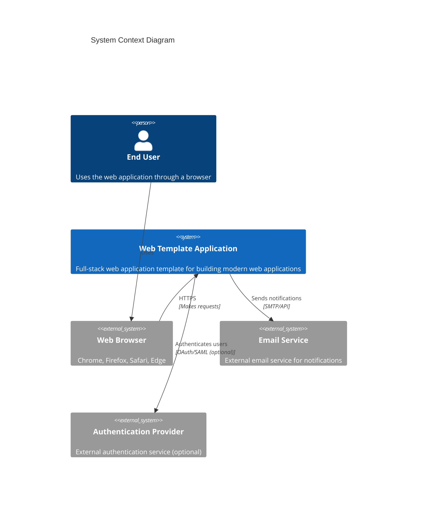
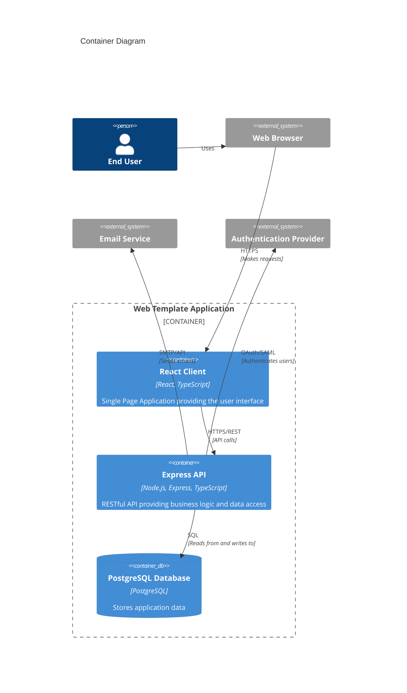
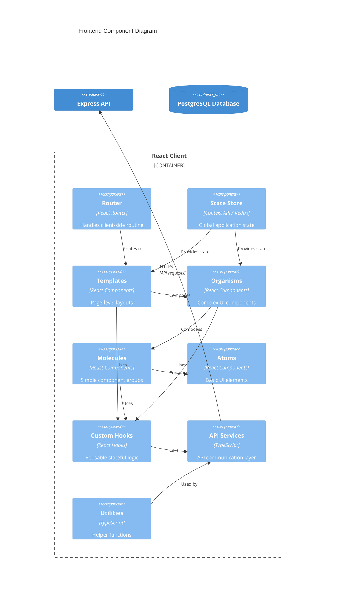
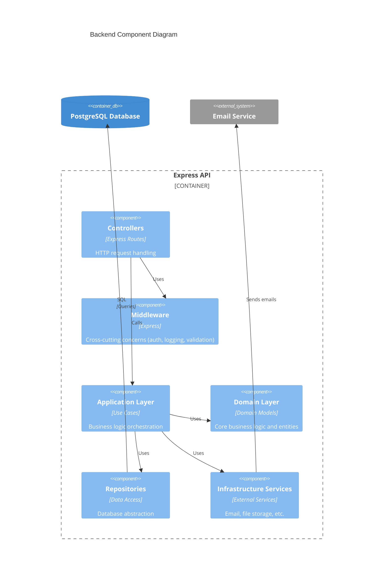
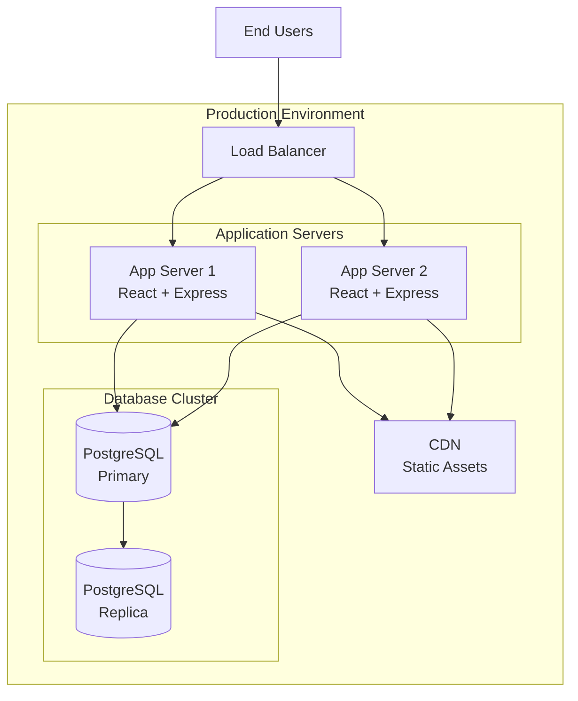

# Architecture Documentation

This document provides a comprehensive overview of the web-template architecture using the C4 model (Context, Container, Component, Code). It serves as a reference for developers, architects, and contributors to understand the system design and make informed decisions.

## Table of Contents

1. [C4 Model Overview](#c4-model-overview)
2. [System Context (Level 1)](#system-context-level-1)
3. [Container View (Level 2)](#container-view-level-2)
4. [Component View (Level 3)](#component-view-level-3)
   - [Frontend Components](#frontend-components)
   - [Backend Components](#backend-components)
5. [Code View (Level 4)](#code-view-level-4)
6. [Architectural Decisions](#architectural-decisions)
7. [Technology Stack](#technology-stack)
8. [Deployment Architecture](#deployment-architecture)

---

## C4 Model Overview

The C4 model is a way to visualize software architecture at different levels of abstraction:

- **Context**: High-level view showing the system and its relationships with users and external systems
- **Container**: Applications and data stores that make up the system
- **Component**: Building blocks within containers
- **Code**: Implementation details of components

For more information, see [c4model.com](https://c4model.com/).

---

## System Context (Level 1)

The System Context diagram shows the web-template system and its relationships with users and external systems.



### System Boundaries

The **Web Template Application** is a full-stack web application template that provides:
- User interface for end users
- RESTful API for data operations
- Authentication and authorization
- Data persistence

### External Systems

- **Web Browser**: Client application used by end users
- **Email Service**: External service for sending notifications (optional)
- **Authentication Provider**: External OAuth/SAML provider (optional, can use built-in auth)

---

## Container View (Level 2)

The Container diagram shows the high-level technology choices and how responsibilities are distributed across containers.



### Containers

#### React Client
- **Technology**: React 18+, TypeScript, Vite/Webpack
- **Responsibilities**:
  - User interface rendering
  - Client-side routing
  - State management
  - API communication
- **Deployment**: Static files served via CDN or web server

#### Express API
- **Technology**: Node.js, Express, TypeScript
- **Responsibilities**:
  - Business logic execution
  - Data validation
  - Authentication/authorization
  - Database access
  - External service integration
- **Deployment**: Node.js process (Docker container)

#### PostgreSQL Database
- **Technology**: PostgreSQL
- **Responsibilities**:
  - Data persistence
  - Transaction management
  - Data integrity
- **Deployment**: PostgreSQL server (Docker container)

---

## Component View (Level 3)

The Component diagram shows the internal structure of containers, breaking them down into their major components.

### Frontend Components



#### Atomic Design Structure

The frontend follows the **Atomic Design** pattern:

1. **Atoms** (`client/src/components/atoms/`)
   - Basic building blocks (Button, Input, Label, Icon)
   - No business logic
   - Highly reusable
   - Example: `<Button>`, `<Input>`, `<Spinner>`

2. **Molecules** (`client/src/components/molecules/`)
   - Simple groups of atoms (SearchBox, FormField, Card)
   - Basic functionality
   - Example: `<SearchBox>` (Input + Button), `<FormField>` (Label + Input)

3. **Organisms** (`client/src/components/organisms/`)
   - Complex UI components (Header, Sidebar, DataTable, Form)
   - Business logic integration
   - Example: `<UserProfile>`, `<DataTable>`, `<Navigation>`

4. **Templates** (`client/src/components/templates/`)
   - Page-level layouts (DashboardLayout, AuthLayout)
   - Structure and composition
   - Example: `<DashboardLayout>`, `<AuthLayout>`

#### Frontend Layers

- **Presentation Layer**: Atoms, Molecules, Organisms, Templates
- **Logic Layer**: Custom Hooks (`client/src/hooks/`)
- **Data Layer**: API Services (`client/src/services/`)
- **State Layer**: State Store (`client/src/store/`)
- **Utility Layer**: Helper functions (`client/src/utils/`)

### Backend Components



#### Backend Architecture Layers

The backend follows a **Layered Architecture** pattern:

1. **Interfaces Layer** (`server/src/interfaces/`)
   - Controllers: HTTP request/response handling
   - Middleware: Authentication, validation, error handling
   - DTOs: Data Transfer Objects for API contracts

2. **Application Layer** (`server/src/application/`)
   - Use Cases: Business logic orchestration
   - Application Services: Coordinate domain objects
   - Command/Query handlers

3. **Domain Layer** (`server/src/domain/`)
   - Domain Models: Core business entities
   - Domain Services: Business rules
   - Value Objects: Immutable domain concepts

4. **Infrastructure Layer** (`server/src/infrastructure/`)
   - Repositories: Data access implementations
   - External Services: Email, file storage, third-party APIs
   - Database: ORM configurations

#### Layer Dependencies

```
Interfaces → Application → Domain ← Infrastructure
```

- **Domain Layer**: No dependencies on other layers (core business logic)
- **Application Layer**: Depends on Domain, uses Infrastructure
- **Interfaces Layer**: Depends on Application
- **Infrastructure Layer**: Depends on Domain, implements interfaces defined in Domain

---

## Code View (Level 4)

The Code view shows key patterns, conventions, and module dependencies at the implementation level.

### Frontend Code Patterns

#### Component Structure

```typescript
// atoms/Button.tsx
interface ButtonProps extends React.ButtonHTMLAttributes<HTMLButtonElement> {
  variant: 'primary' | 'secondary' | 'danger';
  isLoading?: boolean;
}

export const Button: React.FC<ButtonProps> = ({ variant, isLoading, children, ...props }) => {
  return (
    <button className={`btn btn-${variant}`} disabled={isLoading} {...props}>
      {isLoading ? <Spinner /> : children}
    </button>
  );
};
```

#### Custom Hook Pattern

```typescript
// hooks/useFetch.ts
interface UseFetchResult<T> {
  data: T | null;
  error: Error | null;
  isLoading: boolean;
  refetch: () => Promise<void>;
}

export function useFetch<T>(url: string): UseFetchResult<T> {
  const [data, setData] = useState<T | null>(null);
  const [error, setError] = useState<Error | null>(null);
  const [isLoading, setIsLoading] = useState(true);

  // Implementation...
  
  return { data, error, isLoading, refetch };
}
```

#### API Service Pattern

```typescript
// services/userService.ts
import { User } from '../models/User';

class UserService {
  async getUser(id: string): Promise<User> {
    const response = await fetch(`/api/users/${id}`);
    if (!response.ok) {
      throw new Error('Failed to fetch user');
    }
    return response.json();
  }

  async createUser(data: CreateUserInput): Promise<User> {
    const response = await fetch('/api/users', {
      method: 'POST',
      headers: { 'Content-Type': 'application/json' },
      body: JSON.stringify(data),
    });
    return response.json();
  }
}

export const userService = new UserService();
```

### Backend Code Patterns

#### Controller Pattern

```typescript
// interfaces/controllers/UserController.ts
import { Request, Response } from 'express';
import { getUserUseCase } from '../../application/useCases/GetUserUseCase';

export class UserController {
  async getUser(req: Request, res: Response): Promise<void> {
    try {
      const { id } = req.params;
      const user = await getUserUseCase.execute(id);
      res.json(user);
    } catch (error) {
      res.status(500).json({ error: error.message });
    }
  }
}
```

#### Use Case Pattern

```typescript
// application/useCases/GetUserUseCase.ts
import { UserRepository } from '../../domain/repositories/UserRepository';
import { User } from '../../domain/entities/User';

export class GetUserUseCase {
  constructor(private userRepository: UserRepository) {}

  async execute(userId: string): Promise<User> {
    const user = await this.userRepository.findById(userId);
    if (!user) {
      throw new Error('User not found');
    }
    return user;
  }
}
```

#### Repository Pattern

```typescript
// domain/repositories/UserRepository.ts
import { User } from '../entities/User';

export interface UserRepository {
  findById(id: string): Promise<User | null>;
  findAll(): Promise<User[]>;
  save(user: User): Promise<User>;
  delete(id: string): Promise<void>;
}

// infrastructure/repositories/UserRepositoryImpl.ts
import { UserRepository } from '../../domain/repositories/UserRepository';
import { User } from '../../domain/entities/User';
import { db } from '../database';

export class UserRepositoryImpl implements UserRepository {
  async findById(id: string): Promise<User | null> {
    return db.users.findOne({ where: { id } });
  }

  // Other methods...
}
```

#### Domain Entity Pattern

```typescript
// domain/entities/User.ts
export class User {
  constructor(
    public readonly id: string,
    public readonly email: string,
    public readonly name: string,
    public readonly createdAt: Date
  ) {}

  // Domain logic
  canAccessResource(resource: Resource): boolean {
    // Business rule implementation
    return true;
  }
}
```

### Module Dependencies

```
Frontend:
  Components → Hooks → Services → API
  Templates → Organisms → Molecules → Atoms

Backend:
  Controllers → Use Cases → Domain ← Repositories
  Middleware → Controllers
```

---

## Architectural Decisions

### Decision 1: Atomic Design for Frontend

**Context**: Need a scalable and maintainable component structure.

**Decision**: Adopt Atomic Design pattern for React components.

**Rationale**:
- Promotes reusability and consistency
- Clear separation of concerns
- Easy to understand component hierarchy
- Scales well with project growth

**Consequences**:
- ✅ Easy to find and reuse components
- ✅ Clear component responsibilities
- ⚠️ Requires discipline to maintain boundaries
- ⚠️ Can be overkill for small projects

### Decision 2: Layered Architecture for Backend

**Context**: Need separation between business logic and infrastructure concerns.

**Decision**: Use layered architecture with clear boundaries (Interfaces, Application, Domain, Infrastructure).

**Rationale**:
- Domain layer is independent of infrastructure
- Easy to test business logic in isolation
- Clear dependency direction
- Supports multiple interfaces (REST, GraphQL, CLI)

**Consequences**:
- ✅ Testable and maintainable
- ✅ Technology-agnostic domain layer
- ⚠️ More files and boilerplate
- ⚠️ Requires understanding of layers

### Decision 3: TypeScript for Type Safety

**Context**: Need to catch errors at compile time and improve developer experience.

**Decision**: Use TypeScript for both frontend and backend.

**Rationale**:
- Catches errors before runtime
- Better IDE support and autocomplete
- Self-documenting code
- Easier refactoring

**Consequences**:
- ✅ Fewer runtime errors
- ✅ Better developer experience
- ⚠️ Additional compilation step
- ⚠️ Learning curve for JavaScript developers

### Decision 4: Docker for Deployment

**Context**: Need consistent development and production environments.

**Decision**: Use Docker and Docker Compose for containerization.

**Rationale**:
- Consistent environments across team
- Easy local development setup
- Simplified deployment
- Isolated dependencies

**Consequences**:
- ✅ Consistent environments
- ✅ Easy onboarding
- ⚠️ Docker knowledge required
- ⚠️ Additional resource usage

### Decision 5: PostgreSQL for Data Persistence

**Context**: Need reliable relational database with ACID guarantees.

**Decision**: Use PostgreSQL as the primary database.

**Rationale**:
- ACID compliance
- Rich feature set
- Excellent performance
- Strong ecosystem

**Consequences**:
- ✅ Reliable data storage
- ✅ Rich query capabilities
- ⚠️ Requires database management
- ⚠️ Vertical scaling limitations

---

## Technology Stack

### Frontend
- **Framework**: React 18+
- **Language**: TypeScript
- **Build Tool**: Vite or Webpack
- **State Management**: Context API or Redux
- **Routing**: React Router
- **Styling**: CSS Modules, Tailwind CSS, or Styled Components
- **Testing**: Jest, React Testing Library

### Backend
- **Runtime**: Node.js 18+
- **Framework**: Express.js
- **Language**: TypeScript
- **ORM**: TypeORM or Prisma
- **Validation**: Zod or Joi
- **Testing**: Jest, Supertest

### Infrastructure
- **Containerization**: Docker, Docker Compose
- **Database**: PostgreSQL
- **Version Control**: Git
- **CI/CD**: GitHub Actions (configurable)

---

## Deployment Architecture



### Deployment Options

1. **Docker Compose** (Development)
   - Single machine deployment
   - All services in containers
   - Easy local development

2. **Container Orchestration** (Production)
   - Kubernetes, Docker Swarm, or similar
   - Horizontal scaling
   - Service discovery
   - Health checks and auto-recovery

3. **Cloud Platforms**
   - AWS, Azure, GCP
   - Managed services for database
   - CDN for static assets
   - Auto-scaling capabilities

---

## Implementation Examples

### Frontend: Creating a New Component

1. **Atom** (`client/src/components/atoms/Button.tsx`)
   ```typescript
   export const Button: React.FC<ButtonProps> = ({ ... }) => { ... }
   ```

2. **Molecule** (`client/src/components/molecules/SearchBox.tsx`)
   ```typescript
   export const SearchBox: React.FC<SearchBoxProps> = ({ ... }) => {
     return (
       <div>
         <Input {...inputProps} />
         <Button onClick={handleSearch}>Search</Button>
       </div>
     );
   }
   ```

3. **Organism** (`client/src/components/organisms/UserProfile.tsx`)
   ```typescript
   export const UserProfile: React.FC<UserProfileProps> = ({ userId }) => {
     const { data: user, isLoading } = useFetch<User>(`/api/users/${userId}`);
     // ...
   }
   ```

### Backend: Creating a New Feature

1. **Domain Entity** (`server/src/domain/entities/Product.ts`)
   ```typescript
   export class Product {
     constructor(
       public readonly id: string,
       public readonly name: string,
       // ...
     ) {}
   }
   ```

2. **Use Case** (`server/src/application/useCases/GetProductUseCase.ts`)
   ```typescript
   export class GetProductUseCase {
     async execute(id: string): Promise<Product> { ... }
   }
   ```

3. **Controller** (`server/src/interfaces/controllers/ProductController.ts`)
   ```typescript
   export class ProductController {
     async getProduct(req: Request, res: Response): Promise<void> { ... }
   }
   ```

---

## Related Documentation

- [Development Guide](DEV.md) - Setup and development workflow
- [Contributing Guide](CONTRIBUTING.md) - How to contribute
- [TypeScript Patterns](docs/engineering/typescript-patterns.md) - TypeScript best practices
- [Good Practices](docs/engineering/good-practices.md) - Engineering principles

---

## References

- [C4 Model](https://c4model.com/) - Architecture documentation model
- [Atomic Design](https://atomicdesign.bradfrost.com/) - Component design methodology
- [Clean Architecture](https://blog.cleancoder.com/uncle-bob/2012/08/13/the-clean-architecture.html) - Software architecture principles

---

**Last Updated**: January 2026
